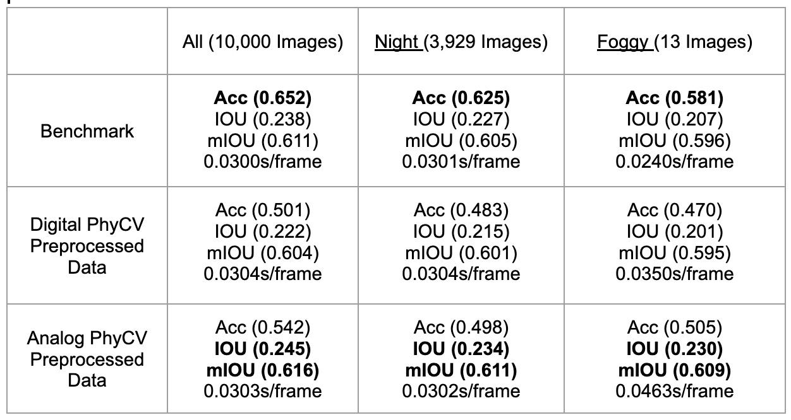
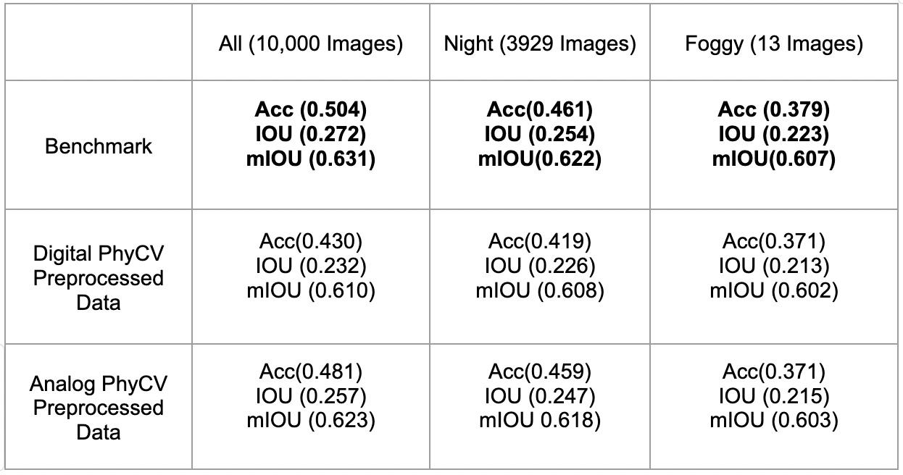
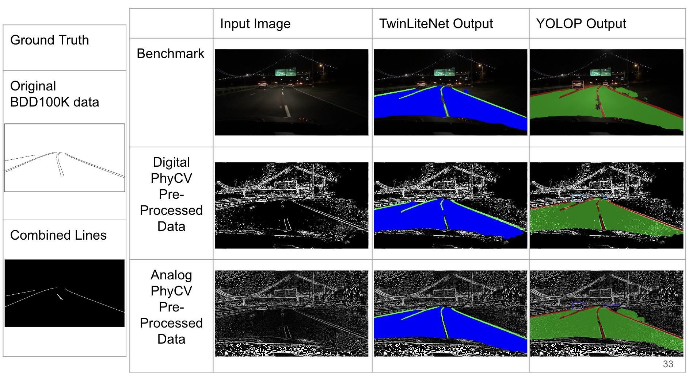
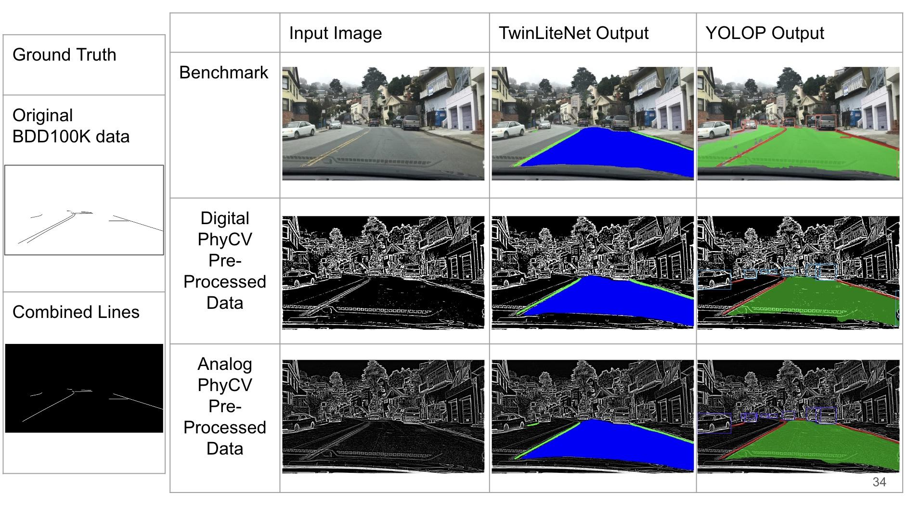

# 2024 Winter ECE279AS Project 3: Lane Detection via Physical Algorithms
This project was done in UCLA ECE279AS in the 2024 Winter Quarter, supervised by Prof. Bahram Jalali, Yiming Zhou, and Callen MacPhee.
## Setup

The suggested project struture is:
```
├─bdd100k
│ ├─images
│ ├─images_foggy
│ ├─images_night
├─bdd100k_preprocessed_analog
│ ├─images
│ ├─images_foggy
│ ├─images_night
├─bdd100k_preprocessed_digital
│ ├─images
│ ├─images_foggy
│ ├─images_night
├─bdd100k_label
│ ├─da_seg_annotations
│ ├─det_annotations
│ ├─ll_seg_annotations
├─YOLOP-main
│ ├─ ...
├─TwinLiteNet-main
│ ├─ ...
├─Weights
│ ├─YOLOP
│ ├─TwinLiteNet
├─code
│ ├─lanedetection.ipynb
│ ├─lanedetectionPreProcessor.ipynb
│ ├─Monitor.ipynb
│ ├─Comparision.ipynb
│ ├─requirements.txt
├─demo.ipynb
```

The substructure of each data folder (e.g., `images`, `images_foggy`, `images_night`) should take the form:
```
images
├─train
├─val
images_foggy
├─train
├─val
images_night
├─train
├─val
```
Due to large size limit, the `bdd100k`, `bdd100k_label`, and `Weights` folders need to be downloaded from the links provide below. `bdd100k_preprocessed_analog` and `bdd100k_preprocessed_digital` folders can be then generated using the preprocessing code in `code/`. 

To run the preprocessing code, `code/requirements.txt` should be statisfied. For training or running inference on any of the models, please use the `requirements.txt` files included in their folders.  

## Important Links

Weights files for trained models: [Weights](https://drive.google.com/drive/u/0/folders/17HPpTAolBZBnmcHTsjMO5RUPojjTv-3E)


BDD100K original images: [bdd100k](https://bdd-data.berkeley.edu/)

Annotations of lane line detection: [det_annotations](https://drive.google.com/file/d/1Ge-R8NTxG1eqd4zbryFo-1Uonuh0Nxyl/view)

Annotations of drivable area segmentation: [da_seg_annotations](https://drive.google.com/file/d/1xy_DhUZRHR8yrZG3OwTQAHhYTnXn7URv/view)

Annotations of lane line segmentation: [ll_seg_annotations](https://drive.google.com/file/d/1lDNTPIQj_YLNZVkksKM25CvCHuquJ8AP/view)

(For annoations, try using the link provided above instead of using those from BDD100K website, because some modifications, such as the combination of parallel lane lines, has been done.)


A collab demo of inference: [demo.ipynb](https://colab.research.google.com/drive/1tHJKpiTG0mY7KiPVXM05YFr-VFhBNLKY#scrollTo=SQSlB2psS8w-) 
(may need to copy folder it is stored in, [Lane_Detection_Code](https://drive.google.com/drive/u/0/folders/1ZIpxhzFyk8FEZX_znE3ooy_xfByrUXJW), to your Google Drive to run it.)

## Tasks

**1. Familiarize yourself with the PST algorithm**

Read the PST paper, download the code from GitHub, and understand the algorithm and parameters.  Generate the sample results as found in the GitHub repository in a Jupyter Notebook.

Key file: `code/lanedetection.ipynb`

See Section 1 of this notebook for examples of running the PST algorithm on various images.

**2. Understand BDD100K dataset**

Explore the BDD100K dataset and repository from Berkeley Deep Drive. Understand data formatting, training, evaluation APIs, and metadata. Create a Colab notebook that uses a PyTorch Dataloader to load images along with their category (daytime, nighttime, fog, etc.). Show images and annotations from each of these categories.

Key file: `code/lanedetection.ipynb`

In Section 2 of this notebook, we load the BDD100K data into a dataframe with image names and the various conditions - weather, time, etc.  We display various example images with their annotations and information, as well as load them into a dataloader for convenient use in teh following steps.

**3. Understand Lane Line Detection Models**

Explore the BDD100K dataset and repository from Berkeley Deep Drive for training and evaluating lane line detection. Demonstrate inference with a pretrained model, and record accuracy on training, validation, and test datasets. You may use a smaller subset of the data if necessary. This will become your benchmark for further experimentation.

Key files: `code/lanedetection.ipynb`, `YOLOP-main/tools/test.py`, `YOLOP-main/tools/demo.py`

In section 3 of the notebook, we demonstrate inference on the pre-trained YOLOP model and record the accuracy and IOU on the training and validation sets. In practice, however, it is easier to directly call `test.py` provided by YOLOP for accuracy and IOU or `demo.py` in the same folder for inference. Please see 5 for the details of calling these functions. 

**4. Preprocess BDD100K images with PST**

Apply PST preprocessing to images in the BDD100K dataset. Understand the impact of parameters on edge enhancement. Find a suitable set of parameters for processing across different images. Compare the performance of PST feature extraction across daytime, nighttime, and foggy scenes.

Key files: `code/lanedetection.ipynb`, `code/lanedetectionPreProcesser.ipynb`

We start by experimenting with several different preprocessing strategies including varying parameters, using different PhyCV algorithms, and applying different morphological operations at the end. See section 4 in `code/lanedetection.ipynb` for the code used to run these experiments.

The pre-processing pipeline we develop is shown as below (from slide 20 of the presentation), which is then implemented in `code/lanedetectionPreProcesser.ipynb` to output new folders with pre-processed data.


In the first section of `code/lanedetectionPreProcesser.ipynb`, we check if the image is nighttime or daytime. If it is nighttime, we run VEViD first to light it up since otherwise PST might destroy features in the darker parts of the image.  After we run PST, we take the default output which is a digital image of 0s and 1s. However, we find that having all the pixels be binary black or white destroys too much information for lane detection. As such, we can also preserve the original analog output which is a spectrum between 0 and 1.  Inspired by the method by which PST converts to a digital image using percentiles, we convert the spectrum to percentiles in each image and then pass to an x -> x^5 function on each individual pixel to remove unwanted background features.

**5. Train a Model on PST Preprocessed Data**

Train the benchmark lane line detection model on the PST preprocessed BDD100K images. Are you able to get back to the same accuracy as the benchmark?


The benchmark model used is [YOLOP](https://github.com/hustvl/YOLOP). Its repository is copied here as “YOLOP-main”. 

*5.1. Environment Preparation*

To train the YOLOP model, we need to follow the instructions in its repository to install all the requirements, which are copied here:

This codebase has been developed with python version 3.7, PyTorch 1.7+ and torchvision 0.8+:

`conda install pytorch==1.7.0 torchvision==0.8.0 cudatoolkit=10.2 -c pytorch`

See `YOLOP-main/requirements.txt` for additional dependencies and version requirements:

`pip install -r requirements.txt`

Note that this CUDA version might be too old for some relatively new NVIDIA GPUs such as RTX 30 and 40 series. If an error occurs, a newer version of CUDA and its corresponding version of PyTorch need to be installed. For example, try using cuda=11.3, pytorch=1.12.0. The installation command can be found in the [PyTorch website](https://pytorch.org/get-started/previous-versions/). According to the pratical experience, also try to avoid using the most updated version of PyTorch, which is imcompactable with the YOLOP code. 

*5.2. Training Process*

First, the file paths of train/val datasets should be updated by going to `YOLOP-main/lib/config/default.py`.

In Line 54,57,58, and 59, change the paths to the image folder, det_annotations folder, da_seg_annotations folder, and ll_seg_annotations folder, separately. The variable “condition” has three options: “” (for all conditions), “_foggy” (for foggy condition only), and “_night” (for night condition only). If training on the whole dataset is required, it should be set to “”. 

Second, tune hyperparameters based on specific requirements. For example, we set the training batch size to be 16 (`_C.TRAIN.BATCH_SIZE_PER_GPU = 16`) to avoid the GPU out of memory error, and set the testing batch size to be 1 (`_C.TEST.BATCH_SIZE_PER_GPU = 1`) because we want to evaluate each image sample individually.

Third, start training by running the following code in the command line:

`python YOLOP-main/tools/train.py`

*5.3. Validation (Testing) Process*

First, set the path of the weight file (.pth) that we want to test on in `YOLOP-main/tools/test.py` (Line 39), and set the specific “condition” variable in `YOLOP-main/lib/config/default.py` mentioned in 5.2 to test on different weather conditions.

Second, start validating by running the following code in the command line:

`python YOLOP-main/tools/test.py`

Please refer to 7 for the final results we get.

*5.4. Track/Compare the accuracy/IOU/MIOU of each epoch*

YOLOP records the testing accuracy/IOU/MIOU of each training epoch in log files in `YOLOP-main/runs`. You may copy the log files you want to track/compare to `code/`, then use `Monitor.ipynb` to visualize the trend of metrics and loss as a function of epoch, or use `Comparison.ipynb` to visualize the difference between several trials. 

*5.5. Error Solution*

The YOLOP code is slightly modified from its original repository due to some bugs: 

a. Error: can't pickle generator objects. This error is solved by modifying some code according to this [website](https://blog.csdn.net/gong4717/article/details/125829915). \
b. RuntimeError: result type Float can't be cast to the desired output type long int. This error is mainly due to incompatible versions, and can be solved by changing the CUDA and PyTorch version suggested by the [website](https://github.com/ultralytics/yolov5/issues/8405). 

**6. Train another Model on PST Preprocessed Data**

Train a lane line detection model with less parameters than the benchmark on the PST preprocessed BDD100K images. Are you able to get back to the same accuracy as the benchmark?

The lightweight model used is [TwinLiteNet](https://github.com/chequanghuy/TwinLiteNet). Its repository is copied here as “TwinLiteNet-main”. 

*6.1. Environment Preparation*

Using the same PyTorch environment as YOLOP is fine.

*6.2. Training Process*

First, the file paths for the train/valid datasets need to be modified by going to `TwinLiteNet-main/DataSet.py`.

In Line 90 and 94, change the paths to the correct validation and training files. In Line 111 and 112, replace the correct training/validation file paths to the corresponding label file paths.

Second, set the training hyperparameters in `TwinLiteNet-main/train.py`.

Third, start training by running the following code in the command line:

`python TwinLiteNet-main/train.py`

*6.3. Validation(Testing) Process*

First, update the path of the weight file (.pth) you want to test on in `TwinLiteNet-main/val.py` (Line 50), and change the batch size to 1 if you want to evaludat each image sample individually.

Second, start validating by running the following code in the command line:

`python TwinLiteNet-main/val.py`


**7. Compare PST+DNN on Night Time Data**

Compare the performance of the PST preprocessed model with the benchmark on specific environment conditions, including nighttime and fog. How do the different techniques compare in terms of robustness?

Key files: `code/lanedetectionPreProcesser.ipynb`

Using the second part of this notebook, we can split every image data folder into `images_foggy` and `images_night` with the foggy and night parts, respectively. This allows us to run inference and test code on these data subsets.

We present our results as follows.

**YOLOP Results**



**TwinLiteNet Results**



We are able to improve the IOU consistently (and even exceed the bench mark) for YOLOP by training on analog PhyCV pre-processed data across normal, night, and foggy conditions. Since IOU takes into account false positives whereas the line (pixel) accuracy does not, we think this is an important improvement. For TwinLiteNet, we are unable to see improvement with our pre-processing strategy, however, different hyperparameter choices in the pre-processing could potentially help with this.

We can see an example of inference on a night image. The analog pre-processed data models’ output tends to be less noisy and is even able to overcome issues like completing gaps between drawn lanes. Compared to the digital pre-processed data models’ output, the analog one seems to be closer to what a human driving would interpret the lanes as.



We can also see an example of the inference on a foggy image.  In this case, the YOLOP benchmark output seems to have the most detailed lane line outputs. Between the digital and analog, we see that the analog model consistently outputs more details than the digital one and is closer to the benchmark and the ground truth.




## References

BDD100K Dataset

- Documentation: [https://doc.bdd100k.com](https://doc.bdd100k.com/format.html)

- Download: [https://bdd-data.berkeley.edu/](https://bdd-data.berkeley.edu/)

YOLOP: You Only Look Once for Panoptic Driving Perception

- Github: [https://github.com/hustvl/YOLOP](https://github.com/hustvl/YOLOP)

- Can download data from links provided in this repository

- Paper: [https://arxiv.org/pdf/2108.11250.pdf](https://arxiv.org/pdf/2108.11250.pdf)

TwinLiteNet: An Efficient and Lightweight Model for Driveable Area and Lane Segmentation in Self-Driving Cars

- Github: [https://github.com/chequanghuy/TwinLiteNet](https://github.com/chequanghuy/TwinLiteNet)

- Paper: [https://arxiv.org/pdf/2307.10705.pdf](https://arxiv.org/pdf/2307.10705.pdf)

PhyCV: The First Physics-inspired Computer Vision Library

- Github: [https://github.com/JalaliLabUCLA/phycv](https://github.com/JalaliLabUCLA/phycv)

- Paper: [https://arxiv.org/pdf/2301.12531.pdf](https://arxiv.org/pdf/2301.12531.pdf) 
