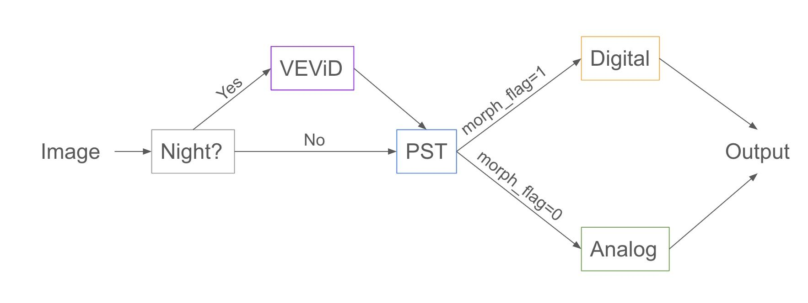
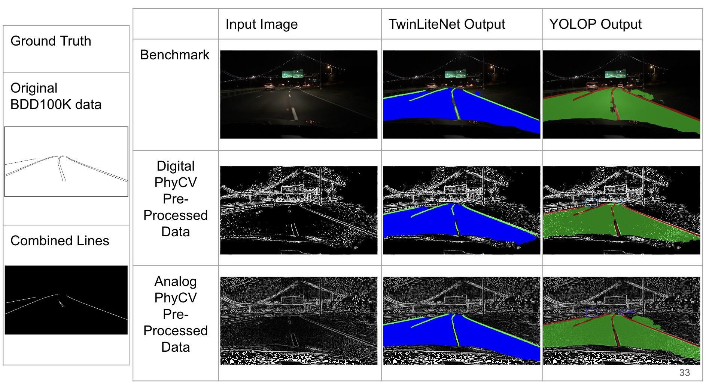
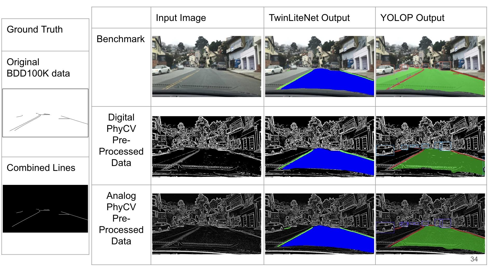

# 2024 Spring ECE279AS Project 3: Lane Detection via Physical Algorithms

## Introduction/Setup

The basic setup is for every data folder (the ground truth, the input images, etc) to be of the form:

Data folder

- train

- val

The specific file paths will likely need to be updated on a per-computer basis.  For example in YOLOP-main/lib/config/default.py there are several variables that store paths to these data folders.  For TwinLiteNet, the TwinLiteNet-main/DataSet.py file will need to be updated with the specific paths.  As an example, the input images in the experiment notebooks tend to be stored in ./bdd100k/images/100k with ground truth in ./bdd100k/labels/lane/masks.

For dependencies, running the lanedetection notebooks in code/ should be done with the requirements.txt file included in code/.  For running inference or training on any of the models please use their requirements.txt files included in their folders.  Strictly speaking, the same environment should work for everything, but following the aforementioned guidelines will minimize the risk of any problems.

## Important Links

Link to weights file for trained models:

Link to collab demo of inference:

(may need to copy folder it is stored in,
, to your drive to run it)

## Tasks

**1. Familiarize yourself with the PST algorithm**

Read the PST paper, download the code from GitHub, and understand the algorithm and parameters.  Generate the sample results as found in the GitHub repository in a Jupyter Notebook.

Key file: code/lanedetection.ipynb

See section 1 of this notebook for examples of running the PST algorithm on various images.

**2. Understanding BDD100K dataset**

Explore the BDD100K dataset and repository from Berkeley Deep Drive. Understand data formatting, training, evaluation APIs, and metadata. Create a Colab notebook that uses a PyTorch Dataloader to load images along with their category (daytime, nighttime, fog, etc.). Show images and annotations from each of these categories.

Key file: code/lanedetection.ipynb

In section 2 of this notebook, we load the data into a dataframe with image names and the various conditions - weather, time, etc.  We display various example images with their annotation and information as well as load them into a dataframe for convenient use in experiments.

**3. Understanding Lane Line Detection Models**

Explore the BDD100K dataset and repository from Berkeley Deep Drive for training and evaluating lane line detection. Demonstrate inference with a pretrained model, and record accuracy on training, validation, and test datasets. You may use a smaller subset of the data if necessary. This will become your benchmark for further experimentation.

Key files: code/lanedetection.ipynb, YOLOP-main/tools/test.py, YOLOP-main/tools/demo.py

In section 3 of the notebook, we demonstrate inference on the pre-trained YOLOP model and record the accuracy and IOU on the training and validation sets.  In practice, however, it is easier to directly call test.py provided by YOLOP for accuracy and IOU or demo.py in the same folder for inference.

**4. Preprocess BDD100K images with PST**

Apply PST preprocessing to images in the BDD100K dataset. Understand the impact of parameters on edge enhancement. Find a suitable set of parameters for processing across different images. Compare the performance of PST feature extraction across daytime, nighttime, and foggy scenes.

Key files: code/lanedetection.ipynb, code/lanedetectionPreProcesser.ipynb

We started by experimenting with several different preprocessing strategies including varying parameters, using different PhyCV algorithms, and applying different morphological operations at the end.  See the former notebook’s section 4 for some of the code used to run experiments.

In the end, the pre-processing pipeline we developed is as shown below (from slide 20 of the presentation) implemented in the latter notebook to output new folders with pre-processed data.

In the first section, we check if the image is nighttime or daytime.  If it is nighttime, then we run VEViD first to light it up since otherwise PST will destroy too many features in the darker parts of the image.  After we run PST, we can take the default output which is a digital image of 0s and 1s, however, we found that having all the pixels be binary black or white destroys too much information for lane detection.  As such, we can also preserve the original analog output which is a spectrum between 0 and 1.  Inspired by the method by which PST converts to a digital image using percentiles, we convert the spectrum to percentiles in each image and then pass to an x -> x^5 function on each individual pixel to remove unwanted background features.

**5. Train a Model on PST Preprocessed Data**

Train the benchmark lane line detection model on the PST preprocessed BDD100K images. Are you able to get back to the same accuracy as the benchmark?

The benchmark model used here is [YOLOP](https://github.com/hustvl/YOLOP). Its repository is copied here as “YOLOP-main”. 

5.1. Environment Preparation

To train the YOLOP model, we will first need to follow the instructions in its repository to install all the requirements, which are copied here:

This codebase has been developed with python version 3.7, PyTorch 1.7+ and torchvision 0.8+:

conda install pytorch==1.7.0 torchvision==0.8.0 cudatoolkit=10.2 -c pytorch

See requirements.txt (in YOLOP-main) for additional dependencies and version requirements:

pip install -r requirements.txt

Note that this CUDA version might be too old for newer NVIDIA GPUs such as RTX 30 and 40 series. If an error occurs, a newer version of CUDA and the corresponding version of PyTorch need to be installed. For example, try using cuda=11.3, pytorch=1.12.0. The installation command can be found on the [PyTorch website](https://pytorch.org/get-started/previous-versions/). 

5.2. Training Process

First, the paths of the training/validation datasets should be updated by going to the YOLOP-main/lib/config/default.py file.

In Line 54,57,58, and 59 of the default.py file, change the path to image folder, det_annotations folder, da_seg_annotations folder, and path of ll_seg_annotations folder, separately. The variable “condition” has three options: “” (for all conditions), “*foggy” (for foggy condition only), and “*_night” (for night condition only). If training on the whole dataset is required, it should be set to “”. 

Second, tune hyperparameters based on specific requirements. For example, we set the training batch size to be 16 (_C.TRAIN.BATCH_SIZE_PER_GPU = 16) to avoid the GPU out of memory error, and set the testing batch size to be 1 (_C.TEST.BATCH_SIZE_PER_GPU = 1) because we want the test each image sample individually.

Third, start training by running the following code in the command line:

python tools/train.py

5.3. Validation Process

First, change the path of the weight file (.pth) we want to test in YOLOP-main/tools/test.py (Line 39), and set the specific “condition” variable in YOLOP-main/lib/config/default.py mentioned in 5.2.

Second, start validation by running the following code int the command line:

`<python tools/test.py>`

Refer to 7 to see all the final results .

5.4. Track the validation accuracy/IOU/MIOU of each epoch

YOLOP records the validation accuracy/IOU/MIOU after each training epoch in .log files in YOLOP-main/runs file. You can copy the log files you want to compare to be under the code file, then use Monitor.ipynb to visualize these metrics and loss with respect to epoch, or use Comparison.ipynb to visualize the difference between different trials. 

**6. Train a Model on PST Preprocessed Data**

Train a lane line detection model with less parameters than the benchmark on the PST preprocessed BDD100K images. Are you able to get back to the same accuracy as the benchmark?

The lightweight model used here is [TwinLiteNet](https://github.com/chequanghuy/TwinLiteNet). Its repository is copied here as “TwinLiteNet-main”. 

6.1. Environment Preparation

Using the same Pytorch environment as YOLOP is fine.

6.2. Training Process

First, the paths for the training/validation dataset need to be modified by going to the TwinLiteNet-main/DataSet.py file.

In Line 90 and 94, change the paths to the correct validation and training files. In Line 111 and 112, replace the correct training/validation file paths to the corresponding label file paths.

Second, set the training hyperparameters in TwinLiteNet-main/train.py.

Third, start training by running the following code in the command line:

python main.py

6.3. Validation Process

First, change the path of the weight file (.pth) we want to test in TwinLiteNet-main/val.py (Line 50), and change the batch size to 1 if we want to test each image sample individually.

Second, start validation by running the following code in the command line:

python val.py

**7. Compare PST+DNN on Night Time Data**

Compare the performance of the PST preprocessed model with the benchmark on specific environment conditions, including nighttime and fog. How do the different techniques compare in terms of robustness?

Key files: code/lanedetectionPreProcesser.ipynb

Using the 2nd part of this notebook, we can split every data_folder into data_folder_foggy and data_folder_night with the foggy and night parts respectively.  This allows us to run inference and test code on these subsets of the data.

We present our results as follows.

**YOLOP Results**

|  | All (10,000 Images) | Night (3,929 Images) | Foggy (13 Images) |
|---|---|---|---|
| Benchmark | Acc (0.652)    
IOU (0.238)  
mIOU (0.611)
0.0300s/frame | Acc (0.625)    
IOU (0.227)  
mIOU (0.605)
0.0301s/frame | Acc (0.581)    
IOU (0.207)  
mIOU (0.596)
0.0240s/frame |
| Digital PhyCV Preprocessed Data | Acc (0.501)    
IOU (0.222)  
mIOU (0.604)
0.0304s/frame | Acc (0.483)    
IOU (0.215)  
mIOU (0.601)
0.0304s/frame | Acc (0.470)    
IOU (0.201)  
mIOU (0.595)
0.0350s/frame |
| Analog PhyCV Preprocessed Data | Acc (0.542)    
IOU (0.245)  
mIOU (0.616)
0.0303s/frame | Acc (0.498)    
IOU (0.234)  
mIOU (0.611)
0.0302s/frame | Acc (0.505)    
IOU (0.230)  
mIOU (0.609)
0.0463s/frame |

**TwinLiteNet Results**

|  | All (10,000 Images) | Night (3929 Images) | Foggy (13 Images) |
|---|---|---|---|
| Benchmark | Acc (0.504)    
IOU (0.272)  
mIOU (0.631)
 | Acc(0.461)    
IOU (0.254)  mIOU(0.622)
 | Acc (0.379)    
IOU (0.223)  
mIOU(0.607)
 |
| Digital PhyCV Preprocessed Data | Acc(0.430)    
IOU (0.232)  
mIOU (0.610)
 | Acc(0.419)    
IOU (0.226)  
mIOU (0.608)
 | Acc(0.371)    
IOU (0.213)  
mIOU (0.602)
 |
| Analog PhyCV Preprocessed Data | Acc(0.481)    
IOU (0.257)  
mIOU (0.623)
 | Acc(0.459)    
IOU (0.247)  
mIOU 0.618)
 | Acc(0.371)    
IOU (0.215)  
mIOU (0.603)
 |

We see that we are able to improve the IOU consistently for YOLOP by training on analog PhyCV pre-processed data across normal, night, and foggy conditions.  Since IOU takes into account false positives whereas the line accuracy does not we think this is an important improvement.  For TwinLiteNet, we were unable to see improvement with our pre-processing strategy, however, different hyperparameter choices in the pre-processing could potentially help with this.

Here we can see an example of running inference on a night image.  Some interesting features are that the analog pre-processed data models’ output tend to be less noisy and are even able to overcome issues like completing gaps between drawn lanes.  Compared with the digital pre-processed data models’ output, the analog ones seem to be closer to what a human driving would interpret the lanes as.

We can also see an example of running inference on a foggy image.  We see that in this case the YOLOP benchmark output seems to have the most detailed lane line outputs.  Between the digital and analog we see that the analog consistently outputs more detail than the digital and is closer to the benchmark and ground truth.

## References

- BDD100K Dataset

- Documentation: [https://doc.bdd100k.com](https://doc.bdd100k.com/format.html)

- Download: [https://bdd-data.berkeley.edu/](https://bdd-data.berkeley.edu/)

- YOLOP: You Only Look Once for Panoptic Driving Perception by Wu et al.

- Github: [https://github.com/hustvl/YOLOP](https://github.com/hustvl/YOLOP)

- Can download data from links provided in this repository

- Paper: [https://arxiv.org/pdf/2108.11250.pdf](https://arxiv.org/pdf/2108.11250.pdf)

- TwinLiteNet: An Efficient and Lightweight Model for Driveable Area and Lane Segmentation in Self-Driving Cars

- Github: [https://github.com/chequanghuy/TwinLiteNet](https://github.com/chequanghuy/TwinLiteNet)

- Paper: [https://arxiv.org/pdf/2307.10705.pdf](https://arxiv.org/pdf/2307.10705.pdf)

- You Only Look at Once for Real-Time and Generic Multi-Task by Wang et al.

- Paper: [https://arxiv.org/pdf/2310.01641v3.pdf](https://arxiv.org/pdf/2310.01641v3.pdf)

- PhyCV: The First Physics-inspired Computer Vision Library by Zhou et al.

- Github: [https://github.com/JalaliLabUCLA/phycv](https://github.com/JalaliLabUCLA/phycv)

- Paper: [https://arxiv.org/pdf/2301.12531.pdf](https://arxiv.org/pdf/2301.12531.pdf) 

List of things to do (delete before posting)

Shihe

- YOLOP repository upload

- Add comments to the comparison and monitor ipynb notebooks that you wrote

- Fill in information on training in the tasks below (5, 6 in particular)

Ash

- Write the collab demo (demo.ipynb) DONE

- Add comments/upload my notebooks (primarily concerning steps 1-4) DONE

- Fill in information in the readme including code structure also add references and the slideshow and link to collab DONE

- Requirements.txt file DONE
